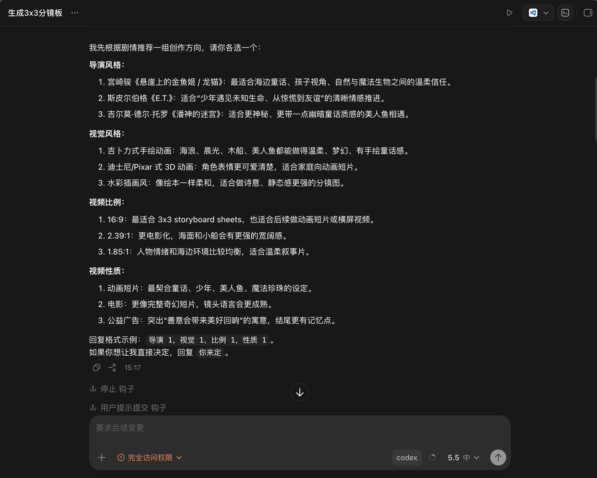
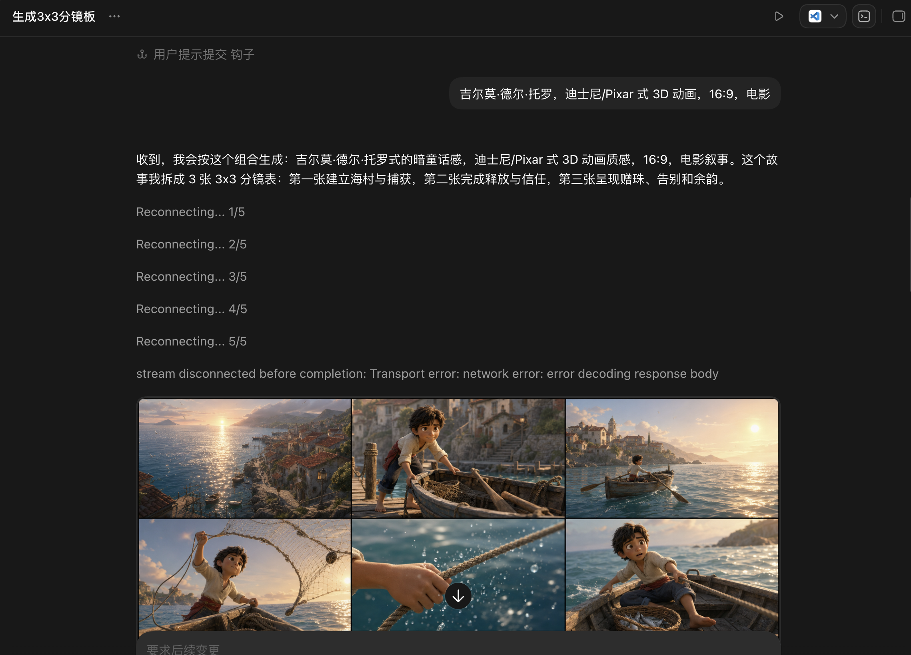
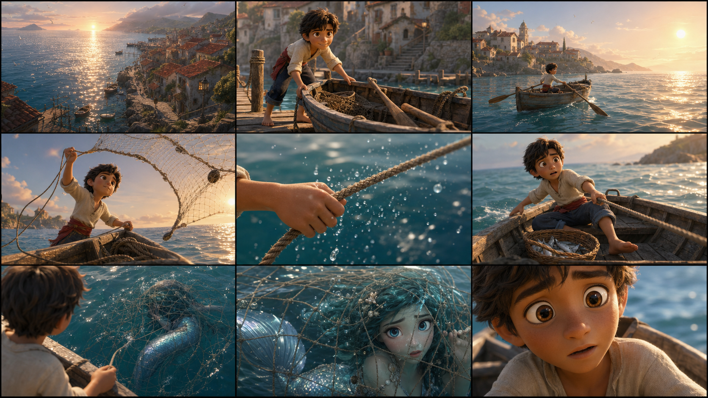
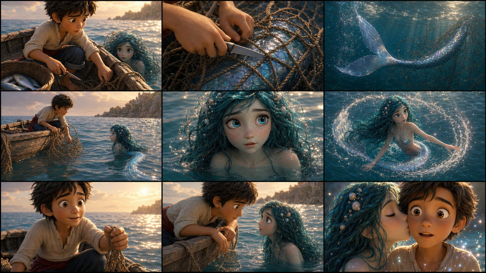
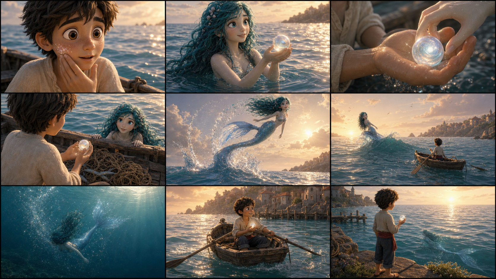
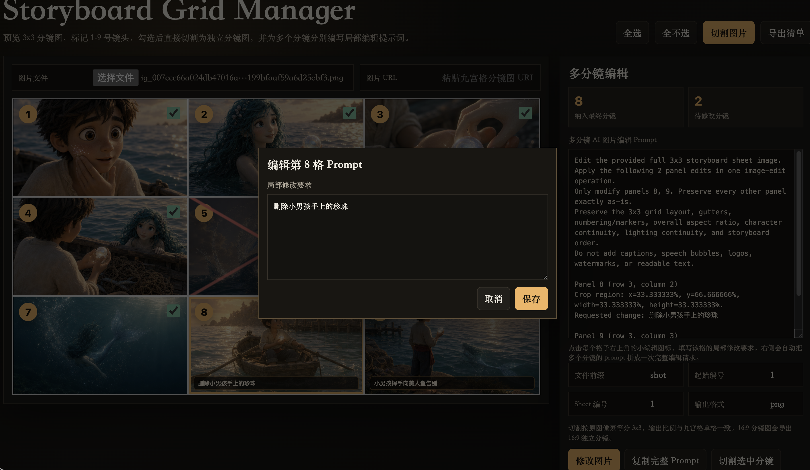
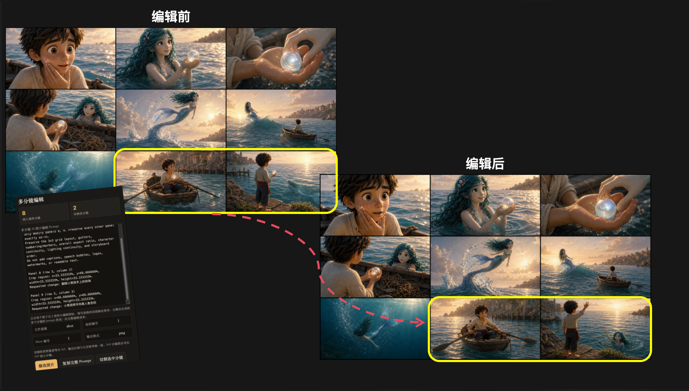
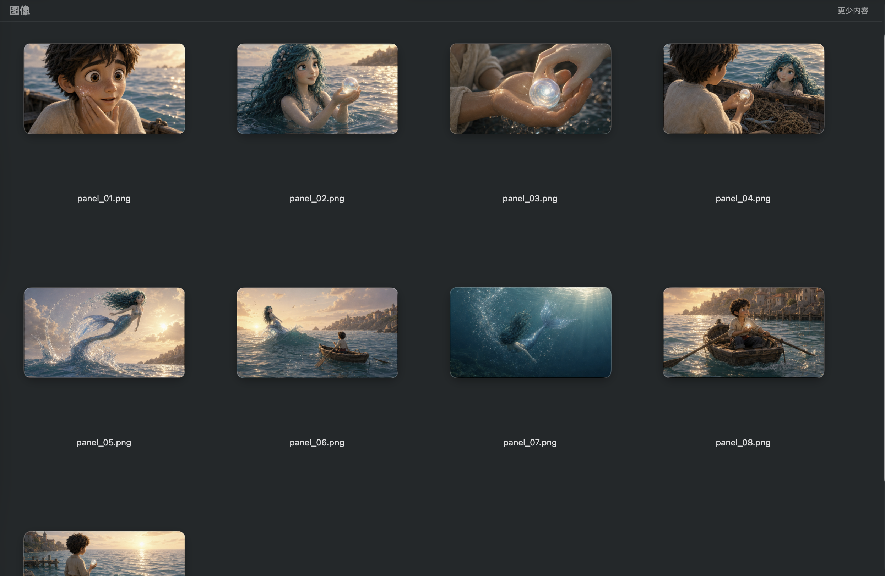

# Cinematic Storyboard Generator 使用指南

这是一个用于创作电影分镜图的 Codex Skill。你可以把原始剧本、故事梗概、短视频脚本或广告创意交给 Codex，它会先分析剧情，再推荐导演风格、画面风格、视频比例和视频类型。你确认方向后，它会继续拆分剧本，生成电影级 3x3 九宫格分镜大图、逐镜头视频生成提示词，并提供切图工具把九宫格拆成独立分镜图片。

本指南面向中国用户，按“照着做就能跑通”的方式编写。

## 这个技能能做什么

1. 自动读剧本，分析人物、场景、情绪、道具、剧情转折和结尾。
2. 给出 2-3 组创作方向建议，包括导演风格、视觉风格、图片比例和视频性质。
3. 根据你的选择，把剧本切成连续镜头，保证人物、服装、场景、道具和光线尽量一致。
4. 调用 Codex APP 上下文中的 GPT-5.5 / Image 2 图片模型生成高质量 3x3 九宫格分镜图。
5. 提供网页工具 `tools/storyboard-grid-manager.html`，用于预览、选择、切割和局部改图提示词整理。
6. 为每个分镜头生成视频提示词，可用于 VEO 3、Seedance、Luma、可灵等视频模型。
7. 支持把九宫格分镜大图切成 9 张独立分镜图片，并生成 `manifest.json` 记录切图信息。

## 效果预览

### 1. Codex 推荐导演风格、画面风格和比例

Codex 会先分析剧本，再推荐导演风格、视觉风格、视频比例和视频性质，让用户在生成分镜前确认整体创作方向。





### 2. 生成的 3x3 九宫格电影分镜大图

下面三张分镜大图使用的参考剧本如下：

```text
once upon a time, in a small coastal village, there lived a boy named Leo.
Every morning, he would set out in his little wooden boat to fish,
the sun glinting on the waves like scattered gold.
One quiet morning, as he hauled in his fishing net, he felt it tug sharply
he had caught something far heavier than any fish.
With a mixture of curiosity and unease, he pulled the net closer
and to his astonishment, a mermaid was trapped inside.
Her silver-blue tail shimmered faintly beneath the tangled net, and her wide,
frightened eyes met his, filled with panic and confusion.
Leo's heart leapt. He had never imagined he would encounter such a magical creature
and worse, it was his net that had ensnared her.
Without hesitation, he set aside the fish and carefully cut the ropes of the net, freeing her tail.
The mermaid floated for a moment, watching him cautiously, her eyes curious but wary.
She twirled slowly in the water, sending tiny droplets sparkling into the sunlight.
Then, as if deciding he meant no harm, she swam closer.
Gently, she pressed her lips to his cheek in a soft, cool kiss,
carrying the scent of the sea and a faint shimmer of magic.
Leo felt warmth spread through him, and a sense of wonder filled his chest.
He realized this was no ordinary encounter--this was a gift of trust and gratitude.
From the water, the mermaid produced a pearl as round and luminous as the moon, placing it carefully into his hand.
It glowed softly, holding the quiet light of the ocean itself.
Leo held it with awe, sensing that it was more than a gift--it was a token of friendship and thanks.
Before leaving, she leapt gracefully through the waves
creating arcs of water that sparkled like liquid diamonds.
She paused for a moment, gazing at him, as if to say, "Remember me, and remember this day."
Then she vanished beneath the sea, leaving only a ripple and a faint shimmer in the morning sun.
Leo rowed back to the shore, clutching the pearl, his mind alight with wonder.
He thought of the mermaid, her gentle eyes, the kiss, and the glowing pearl,
and he realized something extraordinary: sometimes,
the smallest acts of kindness--like freeing a trapped creature--can lead to the most magical rewards.
From that day on, whenever he gazed out at the sea
Leo imagined the mermaid swimming beneath the waves, watching over him, and he smiled,
knowing their paths had crossed in a moment of trust, courage
and gratitude--a memory that would remain a fairy tale in his heart forever.
```

下面三张图是同一个剧本连续生成的三张 3x3 九宫格电影分镜大图，共包含 `3 x 9 = 27` 个分镜镜头。







### 3. 网页工具选择和编辑某个镜头

网页工具可以载入已经生成的 3x3 九宫格分镜大图，选择指定镜头，填写局部修改要求，并生成可用于图片编辑模型的合并 Prompt。





如果某个镜头需要局部修改，建议先在完整九宫格阶段处理，不要先切割。操作方式如下：

1. 在网页工具里打开完整的 3x3 九宫格分镜大图。
2. 点击需要修改的分镜格，填写该镜头的局部修改要求。
3. 点击 `复制完整Prompt` 按钮，获取图片编辑提示词。
4. 将“待编辑的完整九宫格图片”加上这段 Prompt 一起发送给图片编辑模型。
5. 等九宫格编辑满意后，再用网页工具或脚本切割成独立分镜头图片。

注意：Image 2 模型对传图和人物相关编辑限制较多，不建议作为九宫格二次编辑的首选。这里更建议使用 Nano Banana Pro 来编辑完整九宫格分镜图；Nano Banana 一代模型能力不够，复杂分镜、人物一致性和局部精修效果通常不稳定。

### 4. 自动切割后的独立分镜图片



网页工具或切图脚本可以把一张 3x3 九宫格分镜大图自动切割成 9 张独立镜头图片，方便后续逐张进行图生视频。

### 5. 每个镜头对应的视频生成提示词

视频生成提示词展示还在开发中。后续会在这里补充 Codex 输出的 `Video Prompt Style Bible` 和单镜头视频提示词效果图。

## 安装方法

### 方法一：在 Codex APP 里让 Codex 帮你安装

打开 Codex APP，新建对话，输入：

```text
请从 GitHub 安装这个 Codex Skill：
https://github.com/NBchitu/cinematic-storyboard-generator
```

如果 Codex 询问是否允许联网下载，请同意。安装完成后，重启 Codex APP，让新技能生效。

### 方法二：使用 Skill Installer 脚本安装

如果你熟悉命令行，可以运行：

```bash
python3 ~/.codex/skills/.system/skill-installer/scripts/install-skill-from-github.py \
  --repo NBchitu/cinematic-storyboard-generator \
  --path . \
  --name cinematic-storyboard-generator
```

安装完成后重启 Codex APP。

### 方法三：手动安装

也可以手动把项目放到 Codex 的技能目录：

```bash
mkdir -p ~/.codex/skills
git clone https://github.com/NBchitu/cinematic-storyboard-generator.git \
  ~/.codex/skills/cinematic-storyboard-generator
```

然后重启 Codex APP。

## 第一次使用：最简单流程

在 Codex APP 中输入类似下面的话：

```text
使用 cinematic-storyboard-generator，把下面这个故事生成电影分镜。

故事：
一个外卖员在暴雨夜送餐，发现订单地址是一栋即将拆迁的老楼。
他在楼道里遇到一个小女孩，小女孩说这份饭是给妈妈的。
外卖员送到门口后，才发现妈妈其实已经去世多年。
最后他把饭放在门口，楼道灯忽明忽暗，小女孩消失了。
```

技能会先给你一组选择，通常包括：

```text
导演风格：
1. 是枝裕和 ...
2. 王家卫 ...
3. 吉尔莫·德尔·托罗 ...

视觉风格：
1. 微电影文艺风 ...
2. 悬疑惊悚电影风 ...
3. 纪录片风 ...

视频比例：
1. 16:9 ...
2. 2.39:1 ...
3. 9:16 ...

视频性质：
1. 微电影 ...
2. 短视频剧情片 ...
3. 电影 ...
```

你只需要回复：

```text
导演 2，视觉 2，比例 1，性质 1
```

如果不想自己选，可以回复：

```text
你来定
```

## 生成分镜图的标准流程

1. 把完整剧本发给 Codex。
2. 等 Codex 推荐创作方向。
3. 选择导演风格、视觉风格、视频比例和视频性质。
4. Codex 自动拆成镜头，并生成每张 3x3 九宫格分镜图。
5. 检查人物、场景、服装、关键道具是否一致。
6. 如某一张九宫格有问题，让 Codex 只重生成那一张，或使用网页工具整理局部改图提示词。
7. 分镜满意后，切割成独立镜头图片。
8. 使用 Codex 输出的视频提示词，把每张图送入视频模型生成片段。
9. 最后用剪映、Premiere、达芬奇等工具剪辑成长视频。

## 网页工具怎么用

网页工具文件在：

```text
tools/storyboard-grid-manager.html
```

直接用浏览器打开这个 HTML 文件即可使用。

### 网页工具支持的功能

1. 上传或选择已经生成的 3x3 九宫格分镜大图。
2. 自动显示 1-9 号镜头格子。
3. 勾选需要导出的镜头。
4. 点击 `切割图片` 或 `切割选中分镜`，把九宫格拆成独立图片。
5. 修改文件名前缀、起始编号、分镜页码和输出格式。
6. 为单个或多个镜头填写修改说明。
7. 自动生成一段“只修改指定镜头、保留其他镜头”的合并改图提示词。
8. 导出 `manifest.json`，记录每张切图的来源、位置、编号和尺寸。

浏览器支持目录写入时，工具会让你选择一个父文件夹，并自动创建类似这样的输出目录：

```text
storyboard-sheet-01_shots/
```

如果浏览器不支持目录写入，它会改为直接下载切出的图片和 `manifest.json`。

## 用命令行切割九宫格

如果你不想用网页工具，也可以用脚本切图。

先确认本机有 Python 和 Pillow：

```bash
python3 -m pip install pillow
```

切割一张 16:9 九宫格分镜：

```bash
python3 scripts/split_storyboard_grid.py ./storyboard-sheet-01.png --aspect-ratio 16:9
```

切第二张九宫格，并让镜头编号从 10 开始：

```bash
python3 scripts/split_storyboard_grid.py ./storyboard-sheet-02.png \
  --sheet-index 2 \
  --start-index 10 \
  --aspect-ratio 16:9
```

切竖屏 9:16 分镜：

```bash
python3 scripts/split_storyboard_grid.py ./vertical-sheet-01.png \
  --output-dir ./storyboard_frames \
  --aspect-ratio 9:16
```

输出文件名类似：

```text
shot_001_s01_p01.png
shot_002_s01_p02.png
shot_003_s01_p03.png
...
manifest.json
```

## 单独修改某个镜头

如果九宫格里只有某一个镜头不满意，不建议整张重做。推荐这样处理：

1. 打开 `tools/storyboard-grid-manager.html`。
2. 上传九宫格分镜大图。
3. 点击需要修改的镜头，比如第 5 格。
4. 在修改说明里写清楚要改什么，例如：

```text
只修改第 5 格：把女孩手里的红伞改成黄色旧雨伞；保留人物脸型、衣服、楼道、灯光和其他 8 个镜头不变。
```

5. 点击 `修改图片`，复制工具生成的合并提示词。
6. 把原九宫格图片和合并提示词一起交给图片编辑模型。

注意：Image 2 对人物肖像权和真人脸部参考会比较严格。二次修改人物、脸部、姿态时，可以考虑使用 Nano Banana Pro 等更适合改图的模型。

## 去黑边、去模糊和高清化

如果分镜图出现黑边、边框太粗、局部模糊、人物脸崩或分辨率不够，可以按下面方式处理：

1. 先保留原始九宫格，不要覆盖。
2. 用网页工具切出独立分镜。
3. 对有问题的单张分镜做修复。
4. 黑边、模糊、低清晰度问题，建议使用 Nano Banana 第一代模型处理。
5. 提示词可以写：

```text
去掉图片四周黑边，保持原始构图、人物、服装、场景和光线不变，提升清晰度和分辨率，不要新增文字、Logo、水印或额外人物。
```

## 视频生成提示词怎么用

技能生成分镜后，会同时输出：

```text
Video Prompt Style Bible
Video Prompt List
```

`Video Prompt Style Bible` 是全片统一风格说明，包含导演影响、画面风格、镜头语言、光线、色彩、人物设定、世界观连续性和负面提示词。

`Video Prompt List` 是每个分镜头的动画描述。每个镜头通常包含：

1. 镜头编号。
2. 时长，通常 4-8 秒。
3. 连续性说明。
4. 视频生成提示词。
5. 转场意图。
6. 负面提示词。

如果你使用图生视频，建议把对应分镜图作为首帧参考，再粘贴该镜头的视频提示词。

可用于：

```text
VEO 3
Seedance
Luma
可灵
其他文生视频 / 图生视频模型
```

## 推荐工作流

### 短视频剧情片

1. 选择 `9:16` 或 `16:9`。
2. 让技能生成 1-3 张九宫格。
3. 每个镜头生成 4-6 秒视频。
4. 在剪映中按镜头编号排列。
5. 添加字幕、音效、转场和背景音乐。

### 微电影或广告片

1. 选择 `16:9` 或 `2.39:1`。
2. 让技能生成 2-6 张九宫格。
3. 先确认人物、服装、场景和关键道具。
4. 切图后逐张做图生视频。
5. 用统一的 `Video Prompt Style Bible` 控制风格一致性。

### 动画短片

1. 选择 Pixar、吉卜力、日漫、新海诚、水彩、粘土定格等动画风格。
2. 不要在提示词里混入 `photorealistic`、`live-action`、`ultra realistic` 等真人电影词。
3. 每个镜头都保留同一套角色设定和美术风格。
4. 视频生成时强调“动画电影风格”，避免模型漂移成真人。

## 常见问题

### 1. 我只给一句话故事可以吗？

可以。技能会根据这一句话扩展成分镜结构。但如果你想要更稳定的结果，最好补充人物、地点、时代、情绪、结尾和关键道具。

### 2. 一次会生成多少张分镜图？

简单场景通常 1 张九宫格，也就是 9 个镜头。完整短故事通常 2-4 张，也就是 18-36 个镜头。更长剧本会按段落或剧情转折拆成更多张。

### 3. 为什么必须先选择风格？

因为导演风格、画面风格、比例和视频性质会影响所有镜头。如果一开始不固定，后面容易出现人物变脸、场景跳跃、光线不统一和镜头语言混乱。

### 4. 可以让 Codex 不问我，直接生成吗？

可以。在开头加一句：

```text
你来决定导演风格、视觉风格、比例和视频性质，直接生成。
```

### 5. 生成的人物不一致怎么办？

让 Codex 先补一份“人物设定表”，包括年龄、脸型、发型、服装、身材、常用道具和情绪状态。之后每张分镜都引用这份设定。

### 6. 九宫格里有文字、水印或字幕怎么办？

让 Codex 重生成该张图，并强调：

```text
No text, no captions, no speech bubbles, no logos, no watermarks.
```

### 7. 网页工具会联网吗？

`tools/storyboard-grid-manager.html` 是本地单文件网页工具。直接用浏览器打开即可处理本地图片。它主要负责预览、编号、切割、生成修改提示词，不负责真正调用图片模型。

## 项目文件说明

```text
SKILL.md
```

技能核心说明。Codex 会根据这里的规则分析剧本、推荐风格、拆分镜头、生成图片提示词和视频提示词。

```text
references/style-menus.md
```

导演风格、视觉风格、比例和视频性质的选项库。Codex 会从里面挑出适合当前剧本的 2-3 个选项。

```text
tools/storyboard-grid-manager.html
```

本地网页工具。用于打开 3x3 九宫格、选择镜头、切割图片、记录局部改图说明和生成合并改图提示词。

```text
scripts/split_storyboard_grid.py
```

命令行切图脚本。用于把 3x3 九宫格分镜大图拆成 9 张独立图片。

```text
agents/openai.yaml
```

Codex APP 的技能展示信息。

```text
assets/readme-images/
```

README 效果图目录。你后续把演示截图放在这里即可。

## 一句话启动模板

复制下面这段到 Codex APP，然后替换成自己的剧本：

```text
使用 cinematic-storyboard-generator，把下面的剧本生成电影级分镜。

要求：
1. 先推荐 3 种导演风格、3 种视觉风格、3 种视频比例和 3 种视频性质，让我选择。
2. 我选择后，再生成连续的 3x3 九宫格分镜图。
3. 保持人物、服装、场景、道具、光线和情绪连续。
4. 最后输出每个镜头对应的视频生成提示词，方便我用 VEO 3、Seedance、Luma 或可灵生成视频。

剧本：
【把你的剧本粘贴到这里】
```
